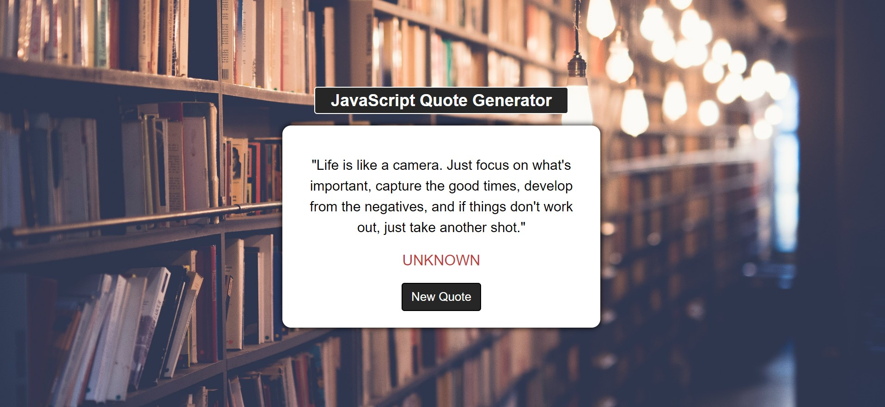

# quote-generator

# Table of contents

1. [Description](#description)
2. [Suggestions](#suggestions)
3. [Visuals](#visuals)
4. [Acknowledgments](#acknowledgments)
5. [Contact](#contact)

---

# Description
 This is an inspirational quote generator that I completed for project 1 thanks to JavaScript DOM Manipulation – Full Course for Beginners on YouTube. I've provided the starter code for anyone that wants to double check their work or use it as a guide to complete the other projects. 
 
 The links to the background photo, google font, FontAwesome are below & in the code:
https://www.pexels.com/photo/light-inside-library-590493/  
https://fonts.google.com/specimen/Roboto?query=roboto  
https://cdnjs.com/libraries/font-awesome

 Feel free to star ⭐ it for easy reference or fork 🔱 it.  

# Suggestions
To get the most out of this youTube tutorial I would recommend doing the below:
- Take notes, create a javascript file and comment out all the notes so it is in the same directory (folder) where your project will be for easy access. Then you can use your notes as a reference when you pause the video.
    - If you do the above, you will end up having 2 .js files but make sure you link the correct file when you add the script in HTML. The file with your notes will just be ignored.
- Try this technique when he is styling in CSS and in the JavaScript file-STOP the video after he explains what he is about to do, BEFORE he shows the code.
    - I actually took a screen shot of what the finished project looked like and used it as a guide to style for each section (header, main-content, quote, etc.) before revealing his code to see if it matched up. 
- Comment out lines of code in CSS and simply show one line at a time to better understand what change took place. 
- Make comments in your code if you don't fully understand something and use Google to research to get clarification. 
- MOST IMPORTANT TIP: 🚫 Don't just copy the code! It is ok to have the code up to use as a guide but go through all the steps on your own to fully grasp the concepts.     

# Visuals

# Acknowledgments
- feeCodeCamp.org & CodeLab for their code and tutorial on JavaScript DOM manipulation : https://youtu.be/5fb2aPlgoys &
https://www.youtube.com/c/CodeLab98

# Contact
  Link to my github:
  https://github.com/Ro-Galvan
  
